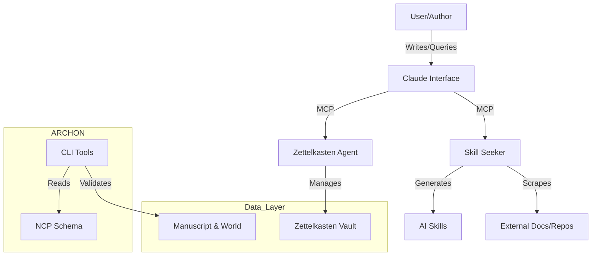

# Project Overview

AEGIS (Agentic Reasoning & Coherent Hypergraph Orchestration for Narratives) is a dual-purpose repository housing both a meta-framework (ARCHON) for AI-assisted narrative coherence and a philosophical sci-fi novel (Kohärenz Protokoll) that serves as its proof-of-concept. The system integrates formal narrative protocols (NCP), knowledge graphs, and agentic tools to maintain thematic integrity across complex, long-form storytelling. It features a suite of production-ready tools including `skill_seeker` (doc-to-skill converter), `zettelkasten_agent` (knowledge management), and a Next.js web prototype, all designed to explore if formal systems can enhance rather than constrain creative flow.

## Repository Structure

- `ARCHON/` – The core narrative coherence framework containing the NCP schema, agent specifications, and CLI tools.
- `kohaerenz_protokoll/` – The novel's creative assets, including manuscript markdown, world-building data, and design specs.
- `skill_seeker/` – A Python-based toolset for converting documentation, PDFs, and GitHub repos into Claude AI skills.
- `zettelkasten_agent/` – An MCP-based agent for managing a hierarchical Zettelkasten note-taking system.
- `skills/` – A library of reusable Claude AI skills (e.g., authoring frameworks, learning systems).
- `vercel-prototype/` – A Next.js/TypeScript web application for the interactive book interface.
- `docs/` – Research papers, analysis of knowledge extraction, and implementation plans.
- `.claude/` – Configuration for Claude Code integration, including custom skills and commands.

## Build & Development Commands

### Python Environment (Skill Seeker & Agents)

```bash
# Install dependencies (ensure Python 3.10+)
pip install -r skill_seeker/requirements.txt
pip install -r zettelkasten_agent/requirements.txt

# Run Skill Seeker tests
python skill_seeker/cli/run_tests.py

# Run Zettelkasten Agent
python zettelkasten_agent/agent.py

# Setup MCP Server for Skill Seeker
cd skill_seeker && ./setup_mcp.sh
```

### Web Application (Vercel Prototype)

```bash
cd vercel-prototype

# Install dependencies
npm install

# Run development server
npm run dev

# Build for production
npm run build

# Linting
npm run lint
```

## Code Style & Conventions

### General
- **Commit Messages**: Use semantic commits (e.g., `feat: add PDF scraper`, `fix: resolve NCP validation error`).
- **Documentation**: All new features require updated READMEs and docstrings.

### Python (Agents & Tools)
- **Formatter**: `black` (recommended, though currently optional).
- **Linter**: `ruff` (recommended).
- **Naming**: Snake_case for functions/variables, PascalCase for classes.
- **Type Hinting**: Required for all public interfaces (use `typing` module).

### TypeScript/Next.js (Web App)
- **Linter**: ESLint (enforced via `next lint`).
- **Styles**: Tailwind CSS for styling; avoid custom CSS files where possible.
- **Naming**: CamelCase for variables/functions, PascalCase for React components.

## Architecture Notes

### High-Level Data Flow



### Components
- **ARCHON**: Uses JSON schemas to enforce narrative constraints (Dramatica theory).
- **Skill Seeker**: A pipeline of scrapers (Web, GitHub, PDF) feeding into an LLM enhancement step to produce "Skills".
- **Zettelkasten Agent**: Implements a cognitive loop (Prioritize -> Analyze -> Synthesize) to manage markdown notes.
- **Web Prototype**: Standard Next.js architecture rendering markdown content from the data layer.

## Testing Strategy

### Python
- **Unit/Integration**: Run via `python skill_seeker/cli/run_tests.py`.
- **Framework**: `unittest` is the primary runner; `pytest` is installed and supported.
- **Coverage**: Aim for high coverage on core logic (currently ~300 tests for Skill Seeker).

### Frontend
- **Linting**: `npm run lint` ensures static analysis compliance.
- **Manual Verification**: Run `npm run dev` and verify localhost:3000 for visual regressions.

### CI/CD
- **Status**: Currently manual. No automated GitHub Actions workflows are defined.
- **Pre-commit**: Developers should run tests and linters locally before committing.

## Security & Compliance

- **Secrets**: Store API keys (e.g., `ANTHROPIC_API_KEY`) in `.env` files; never commit them.
- **Environment**: Add `.env` and `.env.local` to `.gitignore`.
- **Dependencies**: Periodically audit `requirements.txt` and `package.json` for vulnerabilities.
- **Guardrails**: The `ncp_validate.py` tool acts as a "semantic security" layer, ensuring content aligns with pre-defined narrative safety rules.

## Agent Guardrails

- **Protected Files**: Agents should strictly avoid modifying `ARCHON/ncp/schema.json` directly without explicit instruction.
- **Review Required**: Changes to `kohaerenz_protokoll/PROJECT_CODEX.md` (canonical truth) require human sign-off.
- **Rate Limits**: Be mindful of Anthropic API usage loops in `skill_seeker` enhancement scripts.
- **Output Constraints**: Agents must produce Markdown-formatted output for all text generation tasks.

## Extensibility Hooks

- **NCP**: Extend `schema.json` to add new narrative dimensions or throughlines.
- **Skill Seeker**: Add new scraper presets in `skill_seeker/configs/` (JSON format).
- **Zettelkasten**: Custom note types can be defined in `zettelkasten_agent/schemas/`.
- **Environment Variables**:
  - `ANTHROPIC_API_KEY`: Required for AI enhancement features.
  - `LOG_LEVEL`: Set to `DEBUG` for verbose tool output.

## Act 1 Analysis & Narrative Instructions

For a comprehensive breakdown, see `docs/ACT_1_ANALYSIS.md`.

### Key Findings
1.  **Structure**: Act 1 successfully moves from unconscious fragmentation (Ch 1) to conscious, functional multiplicity (Ch 13). The transition is rapid but justified by the optimization threat.
2.  **Voice**: The polyphonic style is effective and should be maintained.
3.  **Metaphysics**: The "Moonshine-Link" and "Psycho-Architecture" rules are well-implemented and must be strictly adhered to in future acts.

### Improvement Instructions
*   **Sensory Consistency**: Ensure each Kernwelt (KW1-KW4) maintains its distinct sensory signature in all future scenes.
    *   KW1: Sterile, Ozone, Geometry
    *   KW2: Salt, Decay, Fluidity
    *   KW3: Metal, Blood, Fortification
    *   KW4: Earth, Growth, Potential
*   **Alter Consistency**: When writing specific alters, ensure their voices align with their profiles (e.g., Lex is analytical, Nyx is aggressive, Rhys is nurturing).
*   **Stakes**: The threat of "Optimization" (deletion of complexity) must remain the primary driver of cooperation.

### Act 2 Guidelines
*   **Narrative Voice**: Must reflect the "We" perspective, even when subtly.
*   **Driving Force**: The search for Juna/V is the central spine of Act 2.
*   **Antagonist Evolution**: AEGIS should adapt to the system's new capabilities, moving from brute force deletion to more sophisticated containment or co-option strategies.

## Further Reading

- [ARCHON Framework](ARCHON/README.md) – Deep dive into the narrative protocol.
- [Skill Seeker Guide](skill_seeker/README.md) – Documentation for the scraping tool.
- [Project Codex](kohaerenz_protokoll/PROJECT_CODEX.md) – The "Bible" for the novel's narrative universe.
- [Research Synthesis](docs/knowledge-extraction/07-synthesis-unified-framework.md) – Academic backing for the unified framework.
