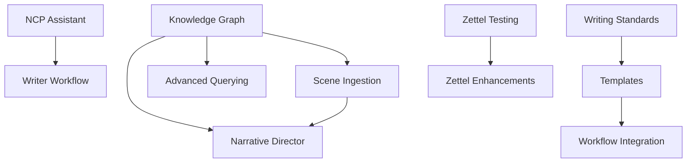

# AEGIS Consolidated Implementation Plan

**Created:** 2025-11-06
**Branch:** `claude/consolidate-todos-implement-011CUrh6FhEQRHgDruHta4S2`
**Purpose:** Unified roadmap consolidating all TODOs and implementation plans

---

## Executive Summary

This document consolidates **6 major TODO sources** across the AEGIS project:

1. **Zettelkasten-Tapestry Skill** - 150+ tasks for knowledge graph integration
2. **Writing Excellence Quest** - Active quest (Rep 1) for writing standards
3. **Knowledge Graph Foundation** - 8 TDD tasks for implementing KG system
4. **NCP Writing Assistant** - 8 TDD tasks for implementing ncp_assist.py
5. **Philosophical Narratives Quest** - ✅ COMPLETED (5 reps shipped)
6. **Ship-Learn-Next Plans** - Learning progression frameworks

**Total Estimated Work:** 200+ hours across 4 priority tiers

---

## 🚨 CRITICAL PRIORITY (Blocking Work)

### 1. Knowledge Graph Foundation Implementation
**Source:** `docs/plans/2025-11-05-knowledge-graph-foundation.md`
**Status:** ❌ Not Started
**Blocking:** Narrative Director, Scene ingestion, Advanced querying
**Estimated Time:** 4-6 hours
**Deliverables:**
- `ARCHON/knowledge_graph/kg_core.py` - Core data structures
- `ARCHON/tools/kg_add.py` - CLI for adding nodes
- `ARCHON/tools/kg_query.py` - CLI for querying graph
- `tests/test_kg_*.py` - Comprehensive test suite

**Implementation:** 8 TDD tasks
1. Design core data structures (Node, Edge, Graph)
2. Implement JSON persistence
3. Add query operations
4. Create kg_add CLI tool
5. Create kg_query CLI tool
6. Implement basic scene ingestion
7. Write documentation
8. Integration testing

**Priority Rationale:** Foundational for narrative memory, enables context-aware writing, prerequisite for Phase 2-3 features.

---

### 2. NCP Writing Assistant Implementation
**Source:** `docs/plans/2025-11-05-ncp-writing-assistant.md`
**Status:** ❌ Not Started
**Blocking:** Writer workflow, Scene generation, Character voice consistency
**Estimated Time:** 2-3 hours
**Deliverables:**
- `ARCHON/tools/ncp_assist.py` - Writing assistant CLI
- Chapter-level prompts
- Scene-specific prompts
- Character voice samples
- JSON output format

**Implementation:** 8 TDD tasks
1. Create test structure
2. Implement chapter prompt generation
3. Implement character voice samples
4. Add scene-specific prompts
5. Add JSON output
6. Integration tests
7. Manual verification
8. Documentation

**Priority Rationale:** Immediate value for writers, completes ARCHON tool suite, enables consistent character voices.

---

## 🔥 HIGH PRIORITY (Core Functionality)

### 3. Writing Excellence Quest - Rep 1 (ACTIVE)
**Source:** `Quest-Integrate-Writing-Excellence.md`
**Status:** 🟢 Active - Rep 1 in progress
**Blocking:** Quality standards for all content, Template system
**Estimated Time:** 2-3 hours for Rep 1
**Deliverables (Rep 1):**
- `docs/writing/Writing-Quality-Audit-2025-11-06.md`
- `docs/writing/Writing-Improvement-Checklist.md`

**5-Rep Progression:**
- **Rep 1** (This Week): Audit & Assess ← **START HERE**
- **Rep 2** (Week 2): Zettelkasten Note Excellence
- **Rep 3** (Week 3): Documentation Clarity Revolution
- **Rep 4** (Week 4): Unified Writing Standards
- **Rep 5** (Week 5): Workflow Integration & Templates

**Priority Rationale:** Writing IS the external cognition system. Quality compounds across all domains.

**Success Metrics:**
- Top 10 improvements identified with examples
- Checklist is immediately actionable
- Ready to apply to Rep 2 (Zettelkasten notes)

---

### 4. Zettelkasten-Tapestry Skill: Testing & Bug Fixes
**Source:** `skills/zettelkasten-tapestry/TODO.md` (Critical section)
**Status:** ✅ Built, ⚠️ Not Tested
**Blocking:** Knowledge base building, Progressive learning
**Estimated Time:** 6-8 hours

**Critical Tasks (from 37 categories):**
1. **Create Pull Request** for existing skill (15 minutes)
2. **Test Scenario 1:** First Learning Quest (1 hour)
3. **Test Scenario 2:** Connection Discovery (1 hour)
4. **Test Scenario 3:** Rep Completion (1 hour)
5. **Fix bugs** discovered in testing (2-3 hours)
6. **Create example knowledge base** (2 hours)

**Priority Rationale:** Skill is complete but untested. Critical for progressive learning workflows.

---

## 🎯 MEDIUM PRIORITY (Enhancements)

### 5. Zettelkasten-Tapestry: Enhance Discovery & Validation
**Source:** `skills/zettelkasten-tapestry/TODO.md` (High Priority section)
**Estimated Time:** 10-15 hours

**Tasks:**
- Add validation scripts (`validate-note.sh`, `health-check.sh`)
- Improve CSO discoverability (test phrases, keywords)
- Create quick reference card
- Enhance connection discovery algorithm
- Add visualization tools

**Priority Rationale:** Improves usability and reliability of existing skill.

---

### 6. Documentation Improvements Across Project
**Source:** Multiple files, Writing Excellence Quest Rep 3
**Estimated Time:** 8-10 hours

**Tasks:**
- Enhance command documentation (`.claude/commands/README.md`)
- Improve skill documentation (`skills/*/README.md`)
- Create documentation writing guide
- Update cross-linking and navigation
- Apply consistent voice and structure

**Priority Rationale:** Better navigation, easier onboarding, reduced user questions.

---

### 7. Writing Excellence Quest - Reps 2-5
**Source:** `Quest-Integrate-Writing-Excellence.md`
**Estimated Time:** 15-20 hours (3-5 hours per rep)

**Remaining Reps:**
- **Rep 2:** Zettelkasten Note Excellence (Week 2)
- **Rep 3:** Documentation Clarity (Week 3)
- **Rep 4:** Unified Writing Standards (Week 4)
- **Rep 5:** Workflow Integration & Templates (Week 5)

**Priority Rationale:** Progressive quality improvement, compounds with each rep.

---

## 📦 LOW PRIORITY (Future Enhancements)

### 8. Zettelkasten-Tapestry: Advanced Features
**Source:** `skills/zettelkasten-tapestry/TODO.md` (Medium/Experimental sections)
**Estimated Time:** 40-60 hours

**Features:**
- Integration with Zettelkasten Agent MCP tools
- Export/import features for other systems
- Progressive learning analytics
- Batch processing tools
- AI-assisted concept extraction
- Spaced repetition integration
- Collaborative knowledge building
- Auto-generate next quest content

**Priority Rationale:** Nice to have, but not blocking core workflows.

---

### 9. Knowledge Graph: Advanced Features (Phase 2-3)
**Source:** `docs/plans/2025-11-05-knowledge-graph-foundation.md` (Notes section)
**Estimated Time:** 30-40 hours

**Features:**
- L2/L3 automatic aggregation
- Semantic search with embeddings
- Graph visualization
- Neo4j backend option
- Advanced NER for entity extraction
- Thematic resonance scoring

**Priority Rationale:** Foundation must work first. These are enhancements.

---

### 10. Narrative System Enhancements
**Source:** Various project files
**Estimated Time:** 50-80 hours

**Features:**
- Narrative Director agent implementation
- Advanced validation with Knowledge Graph
- Style transfer from existing chapters
- Interactive prompt builder
- Batch generation for entire acts

**Priority Rationale:** Phase 2-3 work, depends on Knowledge Graph completion.

---

## 📊 Completed Work (For Reference)

### ✅ Philosophical Narratives Quest (COMPLETE)
**Source:** `Quest-Philosophically-Coherent-Narratives.md`
**Status:** ✅ Quest Complete (2025-11-06)
**Deliverables:**
- Rep 1: Foundation Deep Dive (4,500 words)
- Rep 2: The 6 Pariahs Taxonomy (5,500 words)
- Rep 3: AEGIS vs Foundation Systems (5,000 words)
- Rep 4: Building Philosophically Coherent Narratives (6,000 words)
- Rep 5: Writer's Integration Framework (4,000 words)

**Total Shipped:** 25,000 words of narrative architecture

---

## 🗓️ Recommended Implementation Sequence

### Phase 1: Foundation & Tools (Weeks 1-2)
**Goal:** Complete blocking work, enable core workflows

1. **Week 1, Days 1-2:** Knowledge Graph Foundation (6 hours)
   - Implement all 8 TDD tasks
   - Get tests passing
   - Document thoroughly

2. **Week 1, Days 3-4:** NCP Writing Assistant (3 hours)
   - Implement all 8 TDD tasks
   - Test with real NCP data
   - Update documentation

3. **Week 1, Day 5:** Writing Excellence Quest Rep 1 (3 hours)
   - Complete writing quality audit
   - Create improvement checklist
   - Ship deliverables

4. **Week 2, Days 1-3:** Test Zettelkasten-Tapestry Skill (8 hours)
   - Run all 5 test scenarios
   - Fix discovered bugs
   - Create example knowledge base
   - Submit pull request

5. **Week 2, Days 4-5:** Documentation Sprint (6 hours)
   - Update all tool documentation
   - Improve command README
   - Create quick reference guides

**Phase 1 Deliverables:**
- ✅ Knowledge Graph operational
- ✅ NCP Writing Assistant functional
- ✅ Writing standards audit complete
- ✅ Zettelkasten-Tapestry tested and merged
- ✅ Documentation significantly improved

---

### Phase 2: Quality & Enhancement (Weeks 3-6)
**Goal:** Improve quality, add validation, enhance workflows

1. **Weeks 3-6:** Complete Writing Excellence Quest (Reps 2-5)
   - Rep 2: Enhance Zettelkasten notes
   - Rep 3: Improve documentation
   - Rep 4: Create unified standards
   - Rep 5: Integrate into workflows

2. **Parallel:** Enhance Zettelkasten-Tapestry
   - Add validation scripts
   - Improve CSO discoverability
   - Create visualizations
   - Build quick reference

**Phase 2 Deliverables:**
- ✅ Writing standards unified and automated
- ✅ Templates integrated into workflows
- ✅ Zettelkasten-Tapestry enhanced
- ✅ Quality metrics in place

---

### Phase 3: Advanced Features (Weeks 7-12)
**Goal:** Add advanced capabilities, scale systems

1. **Knowledge Graph Enhancements**
   - L2/L3 aggregation
   - Semantic search
   - Visualization

2. **Zettelkasten-Tapestry Advanced Features**
   - Progressive learning analytics
   - Batch processing
   - Export/import

3. **Narrative System Integration**
   - Narrative Director agent
   - Advanced validation
   - Context-aware generation

**Phase 3 Deliverables:**
- ✅ Knowledge Graph with semantic search
- ✅ Learning analytics operational
- ✅ Narrative Director functional

---

## 🎯 Success Metrics

### Foundation Complete (End of Phase 1)
- [ ] Knowledge Graph: Can add nodes, query, persist to disk
- [ ] NCP Assistant: Generates quality prompts and voice samples
- [ ] Writing Audit: Top 10 improvements identified and documented
- [ ] Zettelkasten-Tapestry: All 5 test scenarios pass, bugs fixed
- [ ] Documentation: 90% of user questions answered in docs

### Quality Integrated (End of Phase 2)
- [ ] Writing standards: Applied consistently across all content types
- [ ] Templates: Integrated into all creation workflows
- [ ] Validation: Automated quality checks in place
- [ ] Zettelkasten notes: 50% increase in connection density
- [ ] Documentation: 30% reduction in "how do I..." questions

### Advanced Capabilities (End of Phase 3)
- [ ] Knowledge Graph: 100+ nodes with thematic resonance queries
- [ ] Learning Analytics: Track progress, suggest next quests
- [ ] Narrative Director: Can generate context-aware scenes
- [ ] System Integration: All tools work together seamlessly

---

## 💡 Key Dependencies



**Critical Path:**
1. Knowledge Graph Foundation (enables everything)
2. NCP Assistant (unblocks writing)
3. Writing Standards Audit (informs quality improvements)
4. Zettelkasten Testing (validates existing work)

---

## 📋 Quick Start Guide

**Starting today? Do this:**

1. **Immediate (Today):**
   ```bash
   # Start Writing Excellence Quest Rep 1
   cd docs/writing
   # Select 12 content pieces to audit
   # Read critically and document findings
   ```

2. **This Week:**
   - Complete Writing Audit (Rep 1)
   - Implement Knowledge Graph Foundation (6 hours)
   - Implement NCP Writing Assistant (3 hours)

3. **Next Week:**
   - Test Zettelkasten-Tapestry (5 scenarios)
   - Fix discovered bugs
   - Update documentation

4. **Following 4 Weeks:**
   - Complete Writing Excellence Quest (Reps 2-5)
   - Apply standards progressively

---

## 🔄 Maintenance & Sustainability

**Ongoing Tasks:**
- Weekly: Review and update TODO progress
- Bi-weekly: Update documentation based on usage
- Monthly: Audit quality metrics
- Quarterly: Review and refine standards

**Continuous Improvement:**
- Track common user questions → improve docs
- Monitor usage patterns → optimize workflows
- Gather feedback → prioritize enhancements
- Test new approaches → validate before scaling

---

## 📚 Reference Links

### Implementation Plans
- [Knowledge Graph Foundation](docs/plans/2025-11-05-knowledge-graph-foundation.md)
- [NCP Writing Assistant](docs/plans/2025-11-05-ncp-writing-assistant.md)

### Active Quests
- [Writing Excellence Quest](Quest-Integrate-Writing-Excellence.md)
- [Ship-Learn-Next Plan](Ship-Learn-Next-Plan-Writing-Excellence.md)

### Completed Quests
- [Philosophical Narratives](Quest-Philosophically-Coherent-Narratives.md) ✅

### Detailed TODOs
- [Zettelkasten-Tapestry TODO](skills/zettelkasten-tapestry/TODO.md) (150+ tasks)

### Core Documentation
- [README](README.md)
- [Project Codex](kohaerenz_protokoll/PROJECT_CODEX.md)
- [ARCHON Tools](ARCHON/tools/README.md)

---

## 💭 Strategic Notes

**What Makes This Plan Work:**

1. **Progressive Complexity:** Start with foundation, build up
2. **Clear Dependencies:** Know what blocks what
3. **Shippable Increments:** Every task produces value
4. **Parallel Tracks:** Can work on multiple fronts
5. **Quality Baked In:** Writing standards improve everything

**What Could Derail This:**

1. **Scope Creep:** Stay focused on current phase
2. **Perfectionism:** Ship v1, iterate
3. **Context Switching:** Finish tasks before starting new ones
4. **Documentation Debt:** Document as you build, not after
5. **Testing Skips:** Write tests first (TDD), saves time

**How to Stay On Track:**

1. **Use TodoWrite:** Track progress visibly
2. **Commit Often:** Small, atomic commits
3. **Test Everything:** If it's not tested, it's broken
4. **Document Immediately:** Fresh context = better docs
5. **Ship Regularly:** Don't let PRs go stale

---

## 🎯 Your First Move

**Start with Writing Excellence Quest Rep 1**

**Today (30 minutes):**
1. Create `docs/writing/` directory
2. Select 12 content pieces to audit:
   - 5 Zettelkasten notes from `zettelkasten_agent/vault/`
   - 3 command files from `.claude/commands/`
   - 2 skill files from `skills/`
   - 2 quest/plan files

**This Week (2-3 hours total):**
1. Read all 12 pieces critically
2. Document findings in audit document
3. Create improvement checklist
4. Ship both deliverables

**Why This First:**
- Informs all future quality improvements
- Quick win (visible progress in days)
- Builds foundation for template system
- Improves your own thinking and writing

---

## ✅ Completion Criteria

**This plan is complete when:**
- [ ] All Phase 1 tasks shipped (Knowledge Graph, NCP Assistant, Writing Audit, Zettel Testing)
- [ ] Documentation updated and comprehensive
- [ ] All tests passing
- [ ] Pull requests merged
- [ ] Tools used successfully in real workflows
- [ ] Quality metrics show improvement
- [ ] Phase 2 ready to start

**Total Estimated Time:**
- Phase 1: 26 hours (2 weeks)
- Phase 2: 60-80 hours (4 weeks)
- Phase 3: 80-120 hours (6 weeks)

**Total Project Scope:** 166-226 hours (~5-7 months at 8 hours/week)

---

**Remember:** Ship → Learn → Next

Start small. Ship fast. Iterate always.

Welcome to the consolidated plan. 🚀

---

**Last Updated:** 2025-11-06
**Status:** Ready for Implementation
**Next Action:** Start Writing Excellence Quest Rep 1 (Audit Phase)
